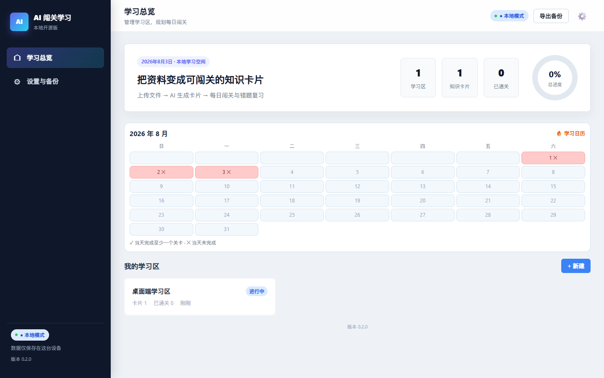
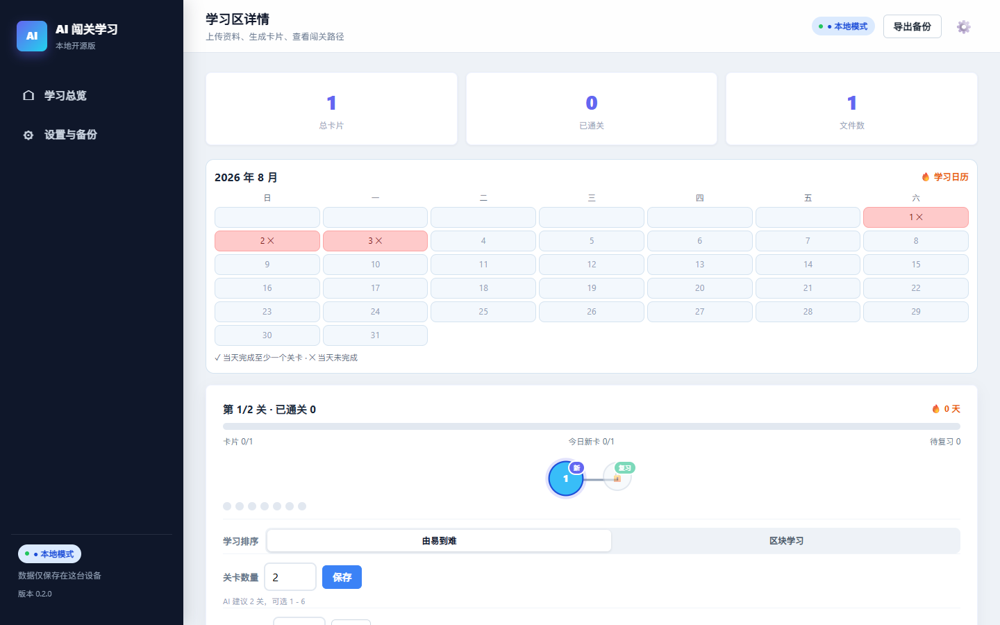
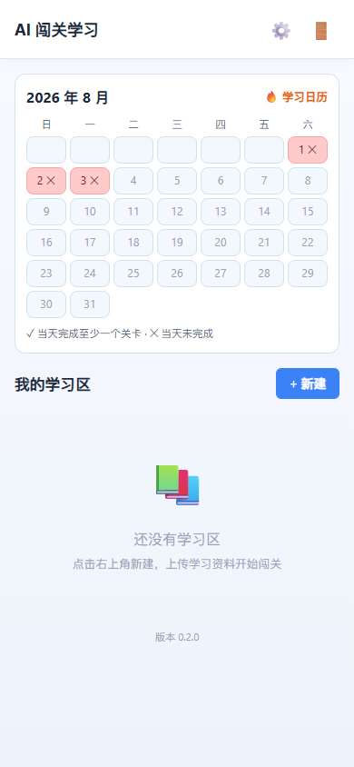
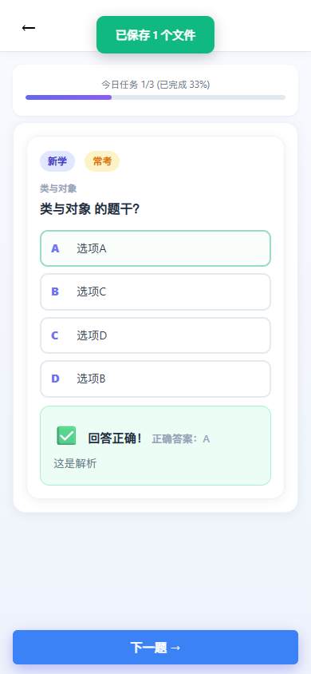

# AI 闯关学习 · 本地开源版

一个本地优先的 AI 闯关学习应用：上传学习资料，AI 自动生成知识卡片，通过“每日闯关 + 错题重排 + 间隔复习”完成学习闭环。

## 特性

- 完全离线可用：数据保存在本机 IndexedDB，不依赖服务器，不需要账号登录
- 打开即用：没有注册、密码、验证码流程
- AI 生成卡片：支持 DeepSeek / OpenAI / Kimi / 通义 / 智谱 / 硅基流动等 OpenAI 兼容接口，用户自带 API Key
- 一卡两面：每个知识点同时生成一张闯关卡和一张记忆卡，闯关答题与翻面记忆互相对应
- 三大卡片库：闯关卡库、记忆卡库、收藏库，支持搜索、收藏置顶、按难度或知识块排序、批量删除与选择学习
- 收藏双区：收藏库并列展示闯关卡区与知识卡区，收藏与位置同步，支持拖动排序
- 学习区操作：手机右滑置顶/删除、桌面右键置顶/删除、首页置顶学习区
- AI 历史：分析结果保留最近 10 次，可查看记录或直接回档使用
- 日历打卡：首页与学习区显示日历，完成关卡自动打勾，未完成打叉
- 四阶段精炼：可选“四阶段精炼”流水线，依次完成结构范围分析、延伸补充、结构化拆解与卡片生成，每个阶段都有人工确认环节
- 双关卡模式：学习区可切换“闯关卡模式”或“记忆卡模式”，排序、错题与间隔复习规则保持一致
- 资料格式：支持文本、Markdown、代码、PDF、Word(.docx) 和图片；上传大小不受应用限制
- 备份目录：电脑和手机可分别设置导出文件夹，导入时优先打开该目录
- 科学学习机制：新学关同时安排正确卡片间隔复习与错题强化复习，采用主动回忆、交错练习和间隔重复
- 闯关路径：新学关与复习关组成的可视化学习路径
- 导入导出：`.zip` 备份可存网盘、云盘或直接发给他人，API Key 不会进入备份文件
- 自动更新：应用启动时自动检查 GitHub 最新版本，发现新版本会提示下载，覆盖安装后数据自动保留
- AI 加速：按文件大小自动选择普通 / 5倍 / 10倍 / 20倍档位，阈值支持 KB/MB 自定义；分析/生成时显示档位、任务数与批次，并可在过程中切换
- 试卷识别：选择题、判断题原样保留题干和选项，生成卡片时自动打乱选项顺序
- 双端界面：手机端保留原移动 UI；桌面端使用专业仪表盘布局（侧边栏、总览、统计与路径）
- PWA：可安装到 Chrome/Edge，断网后仍可打开使用

各版本更新内容见 [版本更新记录](docs/版本更新记录.md)。

## 截图









## 快速开始

```bash
python serve.py
```

浏览器打开 `http://127.0.0.1:8765` 即可使用。

也可以：

```bash
npm run serve
```

## 下载安装包

正式安装包通过 GitHub Releases 发布：

下载页面：https://github.com/K-423-YYY/AI-CardLearning/releases

请按以下说明选择文件安装：

- Windows 电脑（推荐）：下载并安装 **`AI.Setup.0.2.0.exe`**
- Windows 免安装版：下载 **`AI.0.2.0.exe`** 或 **`AI.exe`**，解压/保存后双击打开
- Android 手机：下载并安装 **`app-debug.apk`**

安装后直接打开即可使用，不需要服务器、账号或额外配置。更新时直接下载新版安装包并覆盖安装即可，学习数据会自动保留，不要先卸载旧版。详细步骤见 [安装与卸载说明](docs/安装与卸载说明.md)。

## 测试

```bash
npm test
node tests/e2e-smoke.js
node tests/e2e-verify.js
```

单元测试（27 项）覆盖学习区、每日队列、答题判定、错题、复习排期、关卡排版、批量操作、导入导出、设置加密、本地 AI 文件筛选/批量生成、试卷识别、Word 解析、双库成对卡片、收藏/搜索/删除、记忆卡学习与四阶段精炼；浏览器端到端测试覆盖手机/桌面布局、三库与记忆模式、Toast 自动消失、离线可用、备份导出和示例备份导入。

## 目录结构

```text
app/                        # 本地版主应用（PWA）
  index.html
  manifest.webmanifest
  sw.js
  css/style.css
  js/
    local/                  # 本地数据层、核心业务、AI、PDF、导入导出
    library.js              # 闯关卡库 / 记忆卡库 / 收藏库
    api.js                  # 本地 API 路由
    zones.js / cards.js / settings.js / app.js
  vendor/                   # 本地内置 pdf.js 与 JSZip
desktop/                    # Electron 桌面壳
android/                    # Capacitor Android 配置
docs/                       # 用户说明、构建指南、数据格式
samples/                    # 示例学习区备份
tests/                      # 单元测试与浏览器端到端测试
scripts/                    # 示例备份生成脚本
backend/ frontend/          # 旧服务器版，暂保留
```

## 使用流程

1. 首页点击“新建学习区”
2. 学习区内上传文本、PDF、Word(.docx) 或图片文件
3. 进入“AI 趋势分析”，确认知识点后生成卡片
4. 点击关卡节点开始闯关，答对移出队列，答错回到队尾并重新打乱
5. 在“错题集”集中复习，或把错题加入今日练习
6. 在“设置”中配置 AI 服务商，并定期“导出完整备份”

详细说明见 [用户使用说明](docs/用户使用说明.md)。

AI 联网、国内直连与代理配置见 [AI 联网与代理说明](docs/AI联网与代理说明.md)。

## 构建

- PWA：直接把 `app/` 放到任意静态服务器即可
- Windows 桌面版：见 [开发者构建指南](docs/开发者构建指南.md)
- Android APK：见 [Android 构建说明](android/README.md)

## 数据与隐私

- 所有学习数据只保存在当前设备
- 删除学习区/卡片/文件即永久清空
- API Key 只保存在本机，并且默认不会出现在导出备份中
- 建议定期导出 `.zip` 备份，可存到网盘或本地目录

## 实施进度

按照 [00-实施指南-本地开源版.md](00-实施指南-本地开源版.md)：

- [x] 阶段 A：本地数据层、AI 直连、PDF、无登录
- [x] 阶段 B：导入导出、冲突处理、API Key 隔离
- [x] 阶段 C：PWA、离线可用、备份提醒
- [x] 阶段 D：Electron 脚手架与原生文件对话框
- [x] 阶段 E：Capacitor 配置与构建说明
- [x] 阶段 F：README、文档、示例、GitHub Actions、MIT 许可

Windows 安装包与 Android APK 的实际产出需要在 GitHub Actions 或本机安装依赖后构建。

## License

[MIT](LICENSE)
